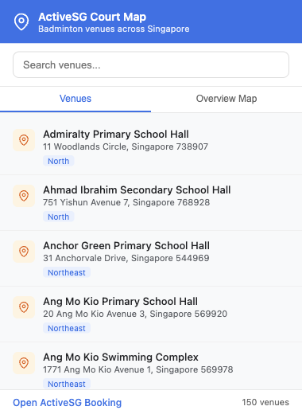
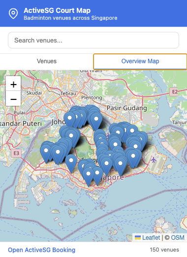
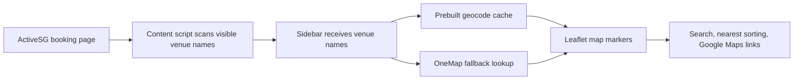

# ActiveSG Court Map

ActiveSG Court Map is a Chrome extension for badminton players in Singapore who want to pick a venue by location, not just by name. It adds map tools to the ActiveSG booking flow, shows where listed courts are, and helps you compare nearby options before you book.

The extension is intentionally narrow: it only runs on `activesg.gov.sg`, only looks for venue names on booking pages, and does not collect analytics or send your browsing data to a private server.

## What It Does

- Adds a floating **Court Map** sidebar on ActiveSG venue pages.
- Detects venue names already visible on the page.
- Maps venues with Leaflet and OpenStreetMap tiles.
- Lets you search venues by name, address, or region from the extension popup.
- Shows all known badminton venues on an interactive overview map.
- Opens any venue in Google Maps for route planning.
- Sorts page venues by distance when you click **Nearest** and allows browser geolocation.

## Screenshots

| Venue list | Overview map |
| --- | --- |
|  |  |

## How It Works



The popup uses the bundled venue database for the all-Singapore overview. The sidebar uses visible page text plus a prebuilt geocode cache, then falls back to OneMap if a venue is missing from the cache.

## Installation For Local Testing

1. Clone or download this repository.
2. Open Chrome and go to `chrome://extensions/`.
3. Enable **Developer mode**.
4. Click **Load unpacked**.
5. Select this project folder.
6. Visit an ActiveSG facility booking page and open the floating map button.

After making code changes, go back to `chrome://extensions` and click the reload icon on the **ActiveSG Court Map** card. Refresh any already-open ActiveSG tab so the updated content script is injected.

## Publishing To The Chrome Web Store

Before publishing, do a final local test of the unpacked extension. Check the popup, sidebar, nearest sorting, geolocation prompt, and Google Maps links.

1. Confirm `manifest.json` has the correct `name`, `description`, `version`, and icons.
2. Create a ZIP package containing the extension files at the ZIP root, not inside an extra parent folder.
3. Open the [Chrome Developer Dashboard](https://chrome.google.com/webstore/devconsole).
4. Choose **Add new item** and upload the ZIP.
5. Fill out the **Store Listing**, **Privacy**, **Distribution**, and **Test instructions** sections.
6. Add at least one screenshot, plus a small promotional image if you want a more complete listing.
7. Submit for review. You can use deferred publishing if you want to review the approved listing before it goes live.

Package command:

```sh
mkdir -p dist
zip -r dist/activesg-court-map-1.2.0.zip \
  manifest.json background.js content.js content.css \
  popup.html popup.css popup.js \
  sidebar.html sidebar.css sidebar.js \
  venues.js geocache.js lib icons \
  README.md PRIVACY.md docs/images
```

Useful listing copy:

> ActiveSG Court Map helps badminton players choose Singapore courts by location. It adds a map sidebar to ActiveSG booking pages, shows known venues in an overview popup, and can sort visible venues by distance when you choose to share your location.

Suggested category: **Productivity** or **Sports**, depending on how you position it.

## Store Listing Assets

Chrome Web Store listings require accurate metadata, icons, and screenshots. Suggested assets:

- Screenshot 1: popup venue list.
- Screenshot 2: popup overview map.
- Screenshot 3: sidebar on an ActiveSG booking page.
- Screenshot 4: nearest sorting after location permission is granted.
- Small promotional image: `440x280`.
- Optional marquee promotional image: `1400x560`.

To capture updated README screenshots, open `popup.html` in a browser at approximately `380x520`, then save:

- `docs/images/popup-list.png`
- `docs/images/popup-overview.png`

For store screenshots, prefer real Chrome screenshots from the installed unpacked extension so reviewers see the actual extension UI.

## Privacy

- The extension does not collect analytics.
- The extension does not send venue browsing activity to a private server.
- The **Nearest** feature uses browser geolocation only after the user clicks the button and grants permission.
- Location is used in the sidebar to sort venues by distance and is not stored by this extension.
- Map tiles are loaded from OpenStreetMap.
- Google Maps links open only when the user clicks them.
- OneMap is queried only when a visible venue needs a geocode fallback.

## Development

This project is built with vanilla JavaScript and Chrome Manifest V3.

Key files:

- `manifest.json`: extension metadata, content-script registration, and web-accessible resources.
- `content.js`: injects the ActiveSG sidebar and scans venue names.
- `sidebar.js`: renders the page-specific map and nearest sorting.
- `popup.js`: renders the toolbar popup venue list and overview map.
- `venues.js`: bundled venue database for the popup.
- `geocache.js`: generated geocode cache used by the sidebar.
- `build-geocache.js`: helper script to regenerate the geocode cache.

Quick checks:

```sh
for f in popup.js sidebar.js content.js background.js venues.js geocache.js build-geocache.js; do
  node --check "$f" || exit 1
done

node -e "JSON.parse(require('fs').readFileSync('manifest.json', 'utf8')); console.log('manifest ok')"
```

## Regenerating The Geocode Cache

Run:

```sh
node build-geocache.js
```

Review the generated `geocache.js` diff before publishing. Geocoding data can change, so spot-check important venues on the map after rebuilding.
